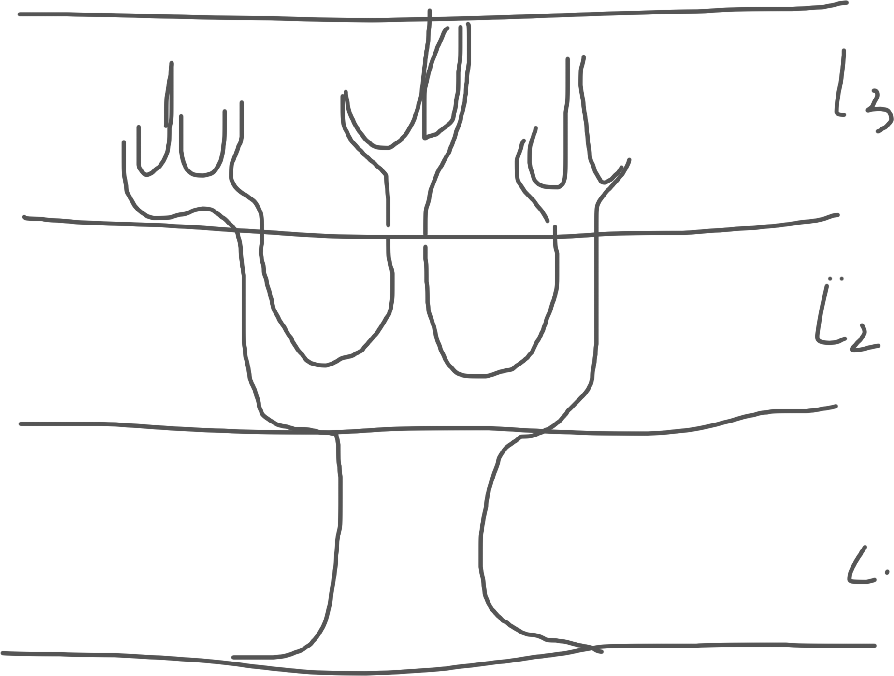

# 文学树结构设计

### 1.根节点：作品总量 
节点定义： 唐宋八大家的作品总集。

### 2.第一节：核心气象
*这一节体现了每位大家的作品总体倾向和气势。*

| 节点类型 | 抽象功能定义 | 数据量化指标（柱状图） | 对比意义 |
| :--- | :--- | :--- | :--- |
| **Mood Index** (情绪指数) | 作品整体的**情感倾向**（积极 vs. 消极）及其强度。 | 统计**积极情感词**和**消极情感词**的**净比值**。 | 衡量作品的整体**激昂**或**低沉**程度。 |
| **Philosophical Depth** (哲思深度) | 作品中**理性思考**和**经世致用**的表达比重。 | 统计**议论词**（道、理、政）和**抽象概念词**的**出现密度**。 | 区分**思辨性**（韩愈、王安石）与**抒情性**（苏轼）的倾向。 |
| **Rhetoric Intensity** (修辞强度) | 作品中**修辞手法**（排比、对仗）的密集程度。 | 统计**排比句式**和**对仗结构**的**句式占比**。 | 反映文风的**气势雄壮**与**结构复杂**程度。 |

---

### 第二节：主题侧重（Thematic Branches）
*这一节分析了每位大家作品的主题内容和关注点。注：左边的枝干代表关心政治，右边的则是寄情山水一类的*

| 节点类型 | 抽象功能定义 | 数据量化指标（柱状图） | 对比意义 |
| :--- | :--- | :--- | :--- |
| **Natural Scenery** (山水自然) | 对**自然环境**的描写和关注。 | **山、水、风、月**等**自然意象**词的**总词频**。 | 对比**山水寄情**（柳宗元、苏轼）的比重。 |
| **Political/Civil Affairs** (政务民生) | 对**官场、百姓、社会治理**的关注。 | **民、政、吏、官、苦**等**社稷意象**词的**总词频**。 | 对比**经世致用**和**政治抱负**的倾向（王安石、曾巩）。 |
| **Historical & Culture** (史学文化) | 对**历史事件、人物和古人**的引用。 | **用典**（Allusion）和**历史人物名**的**引用次数**。 | 对比**借古讽今**和**文化底蕴**的比重（欧阳修、苏轼）。 |

---

### 第三节：用词倾向（The Lexical Profile）
*这一节深入到八大家用词的风格，从词汇的属性进行抽象对比*

| 节点类型 | 抽象功能定义 | 数据量化指标（柱状图） | 对比意义 |
| :--- | :--- | :--- | :--- |
| **Adjective Density** (形容词密度) | 作品中**情感性/描述性**形容词的比例。 | **形容词**占**总词数**的百分比。 | 衡量文风的**抒情性/描写性**与**议论性**的对比。 |
| **Verb Dynamism** (动词活力度) | 作品中**动作性强、有气势**的动词（如“腾”、“卷”、“击”）的比例。 | **动态动词**占**总动词**的百分比。 | 反映文风的**动感、气势**或**沉静、平淡**。 |
| **Archaism Ratio** (古奥词汇比例) | 相对不常用的、**典雅或古奥**的词汇比例。 | **生僻词**、**文言虚词**的**使用频率**。 | 衡量文风的**古奥程度**（韩愈）与**平易清新**程度。 |

---

这三节构成了您的**“文学气象树”**的主体，将八大家的风格从**宏观的气势**到**微观的用词**进行了系统性的量化。接下来，您就可以着手进行数据采集和海报的视觉设计了。

*以下为图示*
